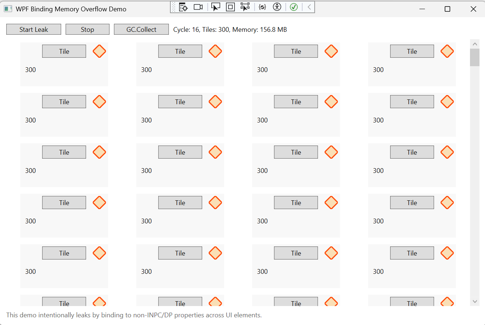
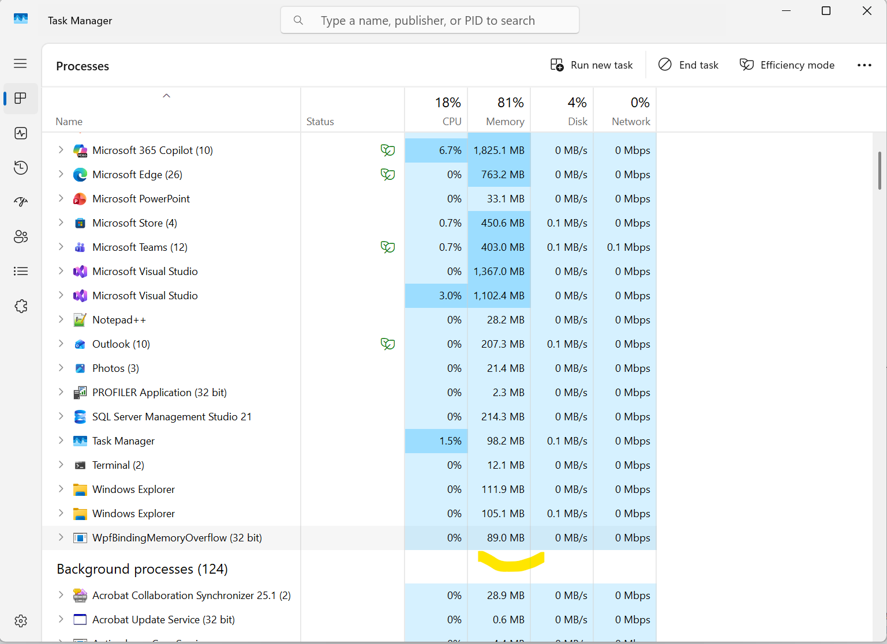
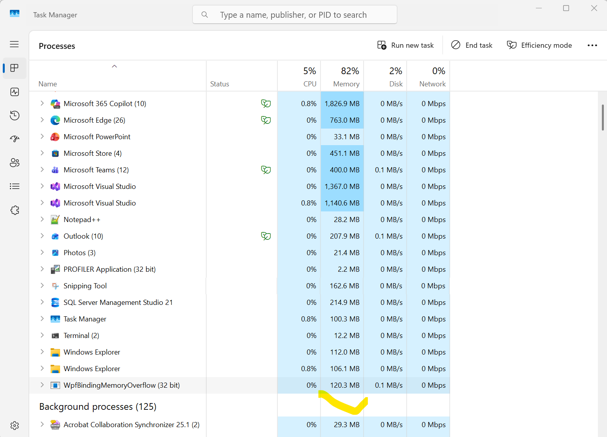
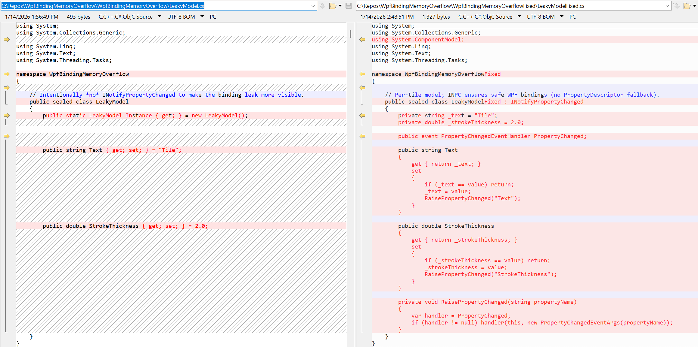
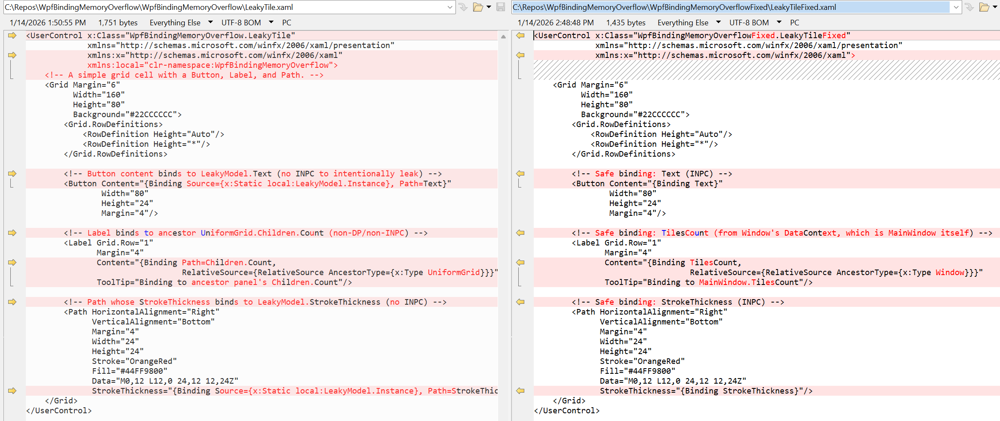
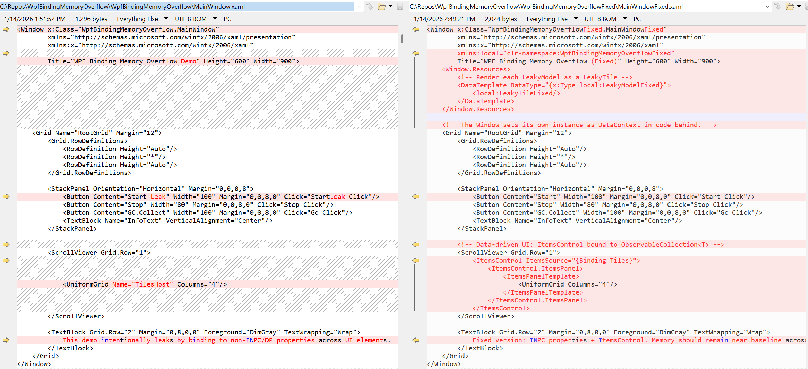
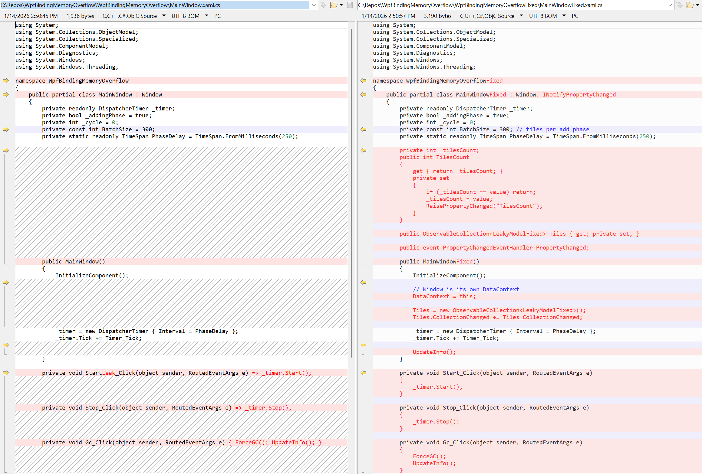
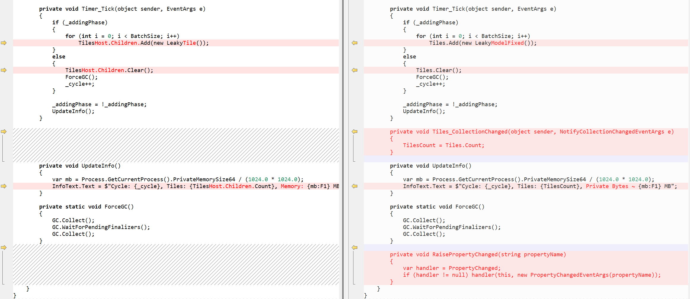

WpfBindingMemoryOverflow
Overview
WpfBindingMemoryOverflow is a WPF (.NET Framework 4.7.2) demo application designed to illustrate a common memory leak scenario in WPF when using data bindings incorrectly. The app repeatedly adds and removes UI elements with bindings that are intentionally unsafe, causing memory usage to grow over time.


How It Works
Main Concept
The application creates and destroys many small UI tiles (LeakyTile) inside a UniformGrid on a timer. Each tile contains:

A Button bound to a property on a singleton model (LeakyModel.Text).
A Label bound to UniformGrid.Children.Count (a CLR property without proper notifications).
A Path bound to another property on the singleton model (LeakyModel.StrokeThickness).
These bindings are intentionally set up to use sources that do not implement INotifyPropertyChanged or Dependency Properties. WPF falls back to PropertyDescriptor subscriptions, which can create strong reference chains and prevent garbage collection of removed elements.
Application Flow

Start Leak button starts a DispatcherTimer.
The timer alternates between two phases: Add Phase: Adds BatchSize (default 300) LeakyTile controls to the UniformGrid.
Remove Phase: Clears all tiles from the grid and forces garbage collection.
Memory usage is displayed in the UI and grows over time, demonstrating the leak.



Why It Leaks

Binding to non-DP/non-INPC properties (e.g., Children.Count and LeakyModel.Text) causes WPF to use PropertyDescriptor.AddValueChanged internally.
These subscriptions can keep references alive even after the controls are removed from the visual tree.
Over multiple add/remove cycles, memory usage ratchets upward.


How to Run

Open the solution in Visual Studio.
Ensure the project targets .NET Framework 4.7.2.
Build and run the application.
Click Start Leak and watch memory usage increase in the UI or via Task Manager.


Observing the Leak

Use Visual Studio Diagnostic Tools or a memory profiler (e.g., dotMemory) to take snapshots.
You will see surviving instances of LeakyTile and related binding objects retained by PropertyDescriptor chains.


Fixing the Leak (Best Practices)

Implement INotifyPropertyChanged on bound models.
Use Mode="OneTime" for bindings that do not need updates.
Avoid binding to CLR properties on other UI elements.
Explicitly clear bindings on teardown:
BindingOperations.ClearAllBindings(myControl);


Purpose
This app is for educational and diagnostic purposes only. It demonstrates how subtle binding patterns can lead to memory leaks in WPF and how to identify and mitigate them in real-world applications.





Fixed app WpfBindingMemoryOverflowFixed

Why this avoids the leak (in the same file structure)

LeakyModel implements INotifyPropertyChanged, so bindings to Text/StrokeThickness use WPF’s change notification mechanism (no PropertyDescriptor.AddValueChanged fallback).
The UI is data-driven via ItemsControl + ObservableCollection<LeakyModel>. Removing items clears visuals and their bindings cleanly.
The Label shows count via TilesCount (an INPC property on the Window), rather than binding to UniformGrid.Children.Count (a plain CLR property on a UI element that can create strong reference retention paths).

The key differences in MainWindow between the leaky app (WpfBindingMemoryOverflow) and the fixed app (WpfBindingMemoryOverflowFixed) are about how the UI is composed and how data is exposed to bindings.
1) UI composition: Direct visual tree mutations vs data‑driven ItemsControl
Leaky version (causes retention)

Adds and removes UI elements directly:
```C#
// Leaky: mutate Grid.Children
for (int i = 0; i < BatchSize; i++)    
	TilesHost.Children.Add(new LeakyTile());
	TilesHost.Children.Clear();
```

The Label in each LeakyTile binds to UniformGrid.Children.Count (a plain CLR property on a UI element), which leads WPF to use PropertyDescriptor.AddValueChanged subscriptions. Those can create strong reference chains and keep visuals alive after removal.

Fixed version (GC‑friendly)

Renders tiles via an ItemsControl bound to a collection:
Plain Textxaml isn’t fully supported. Syntax highlighting is based on Plain Text.<!-- MainWindow.xaml --><ItemsControl ItemsSource="{Binding Tiles}">    <ItemsControl.ItemsPanel>        <ItemsPanelTemplate>            <UniformGrid Columns="4"/>        </ItemsPanelTemplate>    </ItemsControl.ItemsPanel></ItemsControl>Show more lines

The timer adds/removes data items (view models or LeakyModel instances), not UI elements:
```C#
//Fixed: mutate the data collection
for (int i = 0; i < BatchSize; i++)    
	Tiles.Add(new LeakyModel());
	Tiles.Clear();
```

WPF creates and tears down visuals for you based on the data, so bindings are cleaned up correctly.


2) Data context & bindings: UI property binding vs INPC properties
Leaky version

The Label displays a count by binding to UniformGrid.Children.Count:
Plain Textxaml isn’t fully supported. Syntax highlighting is based on Plain Text.<Label Content="{Binding Path=Children.Count,                 RelativeSource={RelativeSource AncestorType={x:Type UniformGrid}}}"/>Show more lines

Some bindings target non‑INPC properties (e.g., LeakyModel without INotifyPropertyChanged), which causes WPF to subscribe via PropertyDescriptor, increasing the chance of retention.

Fixed version

The window becomes the DataContext and exposes INPC properties:
C#public partial class MainWindow : Window, INotifyPropertyChanged{    public ObservableCollection<LeakyModel> Tiles { get; private set; }    public int TilesCount { get; private set; } // raises PropertyChanged    // DataContext = this;}Show more lines

The Label binds to TilesCount (an INPC property), not to a UI element’s CLR property:
Plain Textxaml isn’t fully supported. Syntax highlighting is based on Plain Text.<Label Content="{Binding TilesCount,                 RelativeSource={RelativeSource AncestorType={x:Type Window}}}"/>Show more lines

Each tile binds to INPC properties on LeakyModel (Text, StrokeThickness), so WPF uses its normal (weak) notification path rather than PropertyDescriptor fallbacks.


3) Timer workflow: Add/remove visuals vs Add/remove data

Leaky: DispatcherTimer alternates between adding LeakyTile controls to TilesHost.Children and clearing them.
Fixed: DispatcherTimer alternates between adding LeakyModel items to Tiles and clearing the collection; visuals follow the data.


4) Binding teardown and GC

Leaky: Because bindings target non‑INPC UI CLR properties (Children.Count) and some non‑INPC source properties, WPF maintains subscriptions that can keep controls rooted after removal.
Fixed: All bindings target INPC properties on data objects or the window; WPF’s binding engine uses weak event patterns for INotifyPropertyChanged, so removed visuals are eligible for GC.


Side‑by‑side code sketch (the essence)
Leaky MainWindow.xaml.cs
C#// Adds/removes UI controlsif (_addingPhase){    for (int i = 0; i < BatchSize; i++)        TilesHost.Children.Add(new LeakyTile());}else{    TilesHost.Children.Clear();     // visual tear-down    GC.Collect(); GC.WaitForPendingFinalizers(); GC.Collect();}Show more lines
Fixed MainWindow.xaml.cs
C#// Adds/removes data itemsif (_addingPhase){    for (int i = 0; i < BatchSize; i++)        Tiles.Add(new LeakyModel());        // INPC model}else{    Tiles.Clear();                          // visual tear-down via ItemsControl    GC.Collect(); GC.WaitForPendingFinalizers(); GC.Collect();}Show more lines
Leaky LeakyTile.xaml (problem binding)
Plain Textxaml isn’t fully supported. Syntax highlighting is based on Plain Text.<Label Content="{Binding Path=Children.Count,                 RelativeSource={RelativeSource AncestorType={x:Type UniformGrid}}}"/>Show more lines
Fixed LeakyTile.xaml
Plain Textxaml isn’t fully supported. Syntax highlighting is based on Plain Text.<Label Content="{Binding TilesCount,                 RelativeSource={RelativeSource AncestorType={x:Type Window}}}"/>Show more lines

TL;DR

MainWindow in the fixed app is data‑driven: it exposes an ObservableCollection<LeakyModel> and an INPC TilesCount, sets itself as the DataContext, and uses an ItemsControl to render tiles.
The leaky app directly manipulates the visual tree and binds to a UI CLR property (Children.Count), which encourages binding subscriptions that retain controls.
Moving from visual manipulation to data binding with INPC is the core change that eliminates the memory leak.






